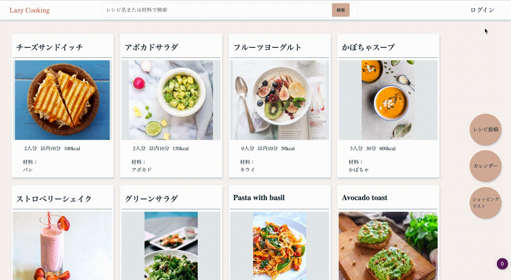
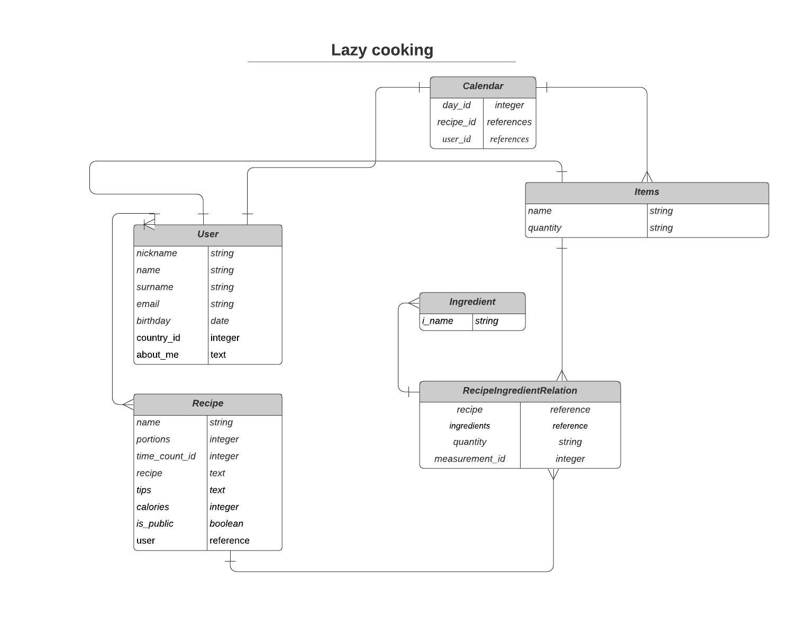

# Lazy Cooking

## **アプリケーション概要：**
* 好きなレシピを投稿します；
* 一週間のメニューを決めます（投稿されたレシピから日毎のメニューを選びます）；
* 決められたメニューの材料からショッピングリストを受取ります；
* スーパーで買い物をする時、ショッピングリストから購入済みアイテムにオーバーラインを引きます。
* 検索欄にて、レシピ名での検索、または複数条件の検索ができます。例：現在持っている材料で、可能なレシピの提案がされます

## **接続先情報:**
URL: http://18.180.27.147:3000/

ID: latte

Pass: 2021

## **テスト用アカウント**

    user 1:
        メールアドレス: test1@gmail.com
        パスワード: cooking1

    user 2:
        メールアドレス: test2@gmail.com
        パスワード: cooking2

## **利用方法**
  * ユーザーログイン：ヘッダー右上のユーザーログインボタンを押します。

    

  * レシピ投稿：トップページのヘッダー直後、またはページの右真ん中にある「レシピ投稿」ボタンを押します。

    
  * カレンダー確認と操作：トップページのヘッダー直後、またはページの右真ん中にある「カレンダー」ボタンを押します。

    
  * ショッピングリストー確認と操作：トップページのヘッダー直後、またはページの右真ん中にある「ショッピングリスト」ボタンを押します。

   

  * 検索：ヘッダーの真ん中にある検索欄でキーワードを入れて「検索」ボタンを押します。複雑な条件で検索の場合は「検索」ボタンの右にある「複雑な検索」ボタンと押します。

     

## **目指した課題解決**
  料理と食品購入時間を短縮したい、スーパーで必要な食材を買い忘れたくない、今日は何を作るかと悩みたくない人向けのアプリです。

## **洗い出した要件**
* ユーザー管理
  ユーザー登録
  ユーザーのログイン・ログアウト
  ユーザーのプロファイル編集
* レシピ管理
  レシピ一覧表示
  レシピ編集
  レシピ消去
* 検索機能
  レシピ検索（レシピ名もしくは材料名で）
  複数の検索条件を併せて検索(「〜材料と〜材料」が共に入っているレシピ、または「〜材料＋〜タグ」など)
* カレンダー管理
  今週のメニュー一覧表示
  カレンダーへレシピ登録
  カレンダーに登録されたレシピ・リスト編集と消去
* ショッピングリスト管理
  ショッピングリスト表示
  ショッピングリストの内容を追加

  **実装予定の機能**
  ショッピングリストで購入済みの材料の棒線でマークする
  カレンダーで1日のカロリー総合表示
  他人レシピの「いいね」機能
  他人のレシピを自分のレシピリストに追加する機能
  色々なユーザが投稿するレシピのニュースフィード表示
  アプリのデザインテーマ選択機能
  レシピの人気ランキングor先着順番の並び替え機能
  モバイルバージョンのためのレスポンシブデザイン
  SNS認証
  レシピのコメント

## **データベース設計	ER図**

## **ローカルでの動作方法**

git cloneしてから、下記のgemのインストールが必要です：
  * gem 'devise',
  * gem 'active_hash',
  * gem 'mini_magick',
  * gem 'image_processing', '~> 1.2'
rails db:migrateを行います。

### 使用環境：
フロントエンド： JavaScript
バックエンド：Ruby on Rails 6.0.0, Ruby 2.6.5p114
データーベース：MySQL2

